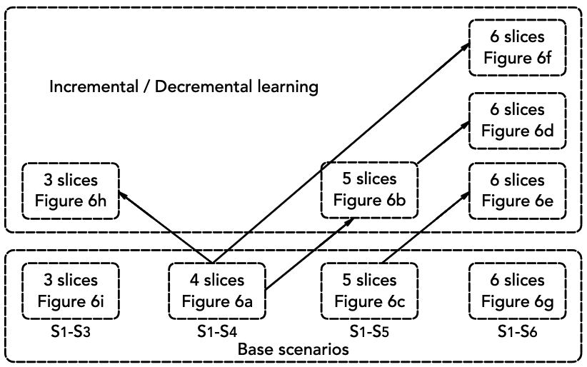
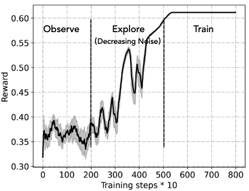
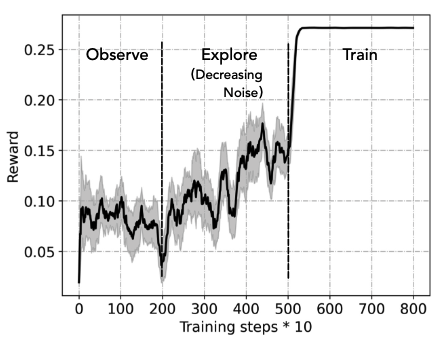
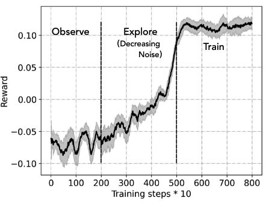
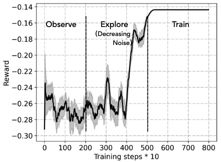
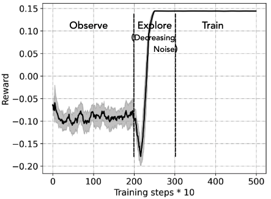
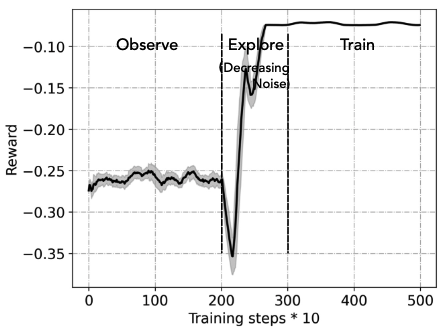
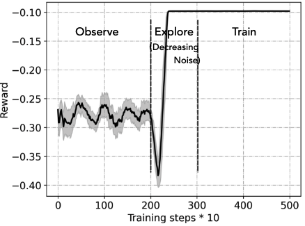
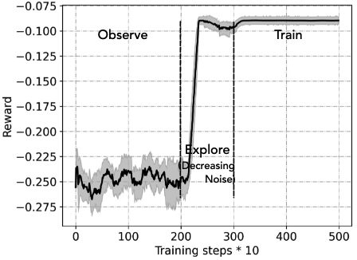
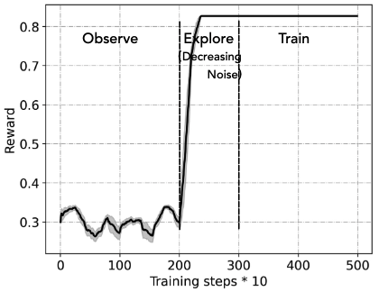

# Inremental_MADDPG_Network_Slicing

*This work is supported by the UK-funded project REASON under the Future Open Networks Research Challenge sponsored by DSIT.*

**A Brief description of this repository:** 

Multi-access edge computing provides local resources in mobile networks as the essential means for meeting the demands of emerging ultra-reliable low-latency communications. At the edge, dynamic computing requests require advanced resource management for adaptive network slicing, including resource allocations, function scaling and load balancing to utilize only the necessary resources in resource-constraint networks. 

Recent solutions are designed for a static number of slices. Therefore, the painful process of optimization is required again with any update on the number of slices. In addition, these solutions intend to maximize instant rewards, neglecting long-term resource scheduling. Unlike these efforts, we propose an algorithmic approach based on multi-agent deep deterministic policy gradient (MADDPG) for optimizing resource management for edge network slicing. Our objective is two-fold: (i) maximizing long-term network slicing benefits in terms of delay and energy consumption, and (ii) adapting to slice number changes.

**Handbook** 

The base file includes three: 'MADDPG.py' and 'multi-agent.py' to provide AI, and 'Environment.py' to support AI learning and demonstrate the network and slices in the network.

Apart from that, as you have seen, there are files titled in the format 'XtoY_slices' and 'X_slices'. These are the application scenarios with different numbers of network slices, where 'X_slices' denotes the base scenario, training MADDPG from scratch; and on the other hand, 'XtoY_slices' represents the incremental learning model origin from scenario *X* to *Y*. 

You can easily run the DRL process by the 'main.py' file in each parent direction for the corresponding scenario. And before applying incremental learning, it is better to finish the base scenarios in case of errors and lack of dependency. All results will be automatically saved in the 'results' file in the same direction. For visual results, just run 'read_out.py'.

The following figure represents the experimental relationships between those cases. If you are confused about FigureXX, you are able to find correct correspondence relations in 'Manuscript.pdf', or you can check it at https://arxiv.org/abs/2310.17523. And it definitely can help you better understand the code and logic.

For base scenarios 3, 4, 5 and 6, you will get similar figures like (hopefully order is correct):

<table>
    <tr>
        <td></td>
        <td></td>
    </tr>
    <tr>
        <td></td>
        <td></td>
    </tr>
</table>

And for 4-5, 4-5-6, 4-6, 5-6 and 4-3, you will see figures like:

<table>
    <tr>
        <td></td>
        <td></td>
    </tr>
    <tr>
        <td></td>
        <td></td>
    </tr>
    <tr>
        <td></td>
        <td></td>
    </tr>
</table>

You will find more information in the comments through the code. Hope you like it.

If you need help, easily raise an issue. Or come to me / my colleague Yulin by *ocean.h.li@bristol.ac.uk / yuelin.liu@bristol.ac.uk*.
Our supervisors are Dr Shuangyi Yan (*shuangyi.yan@bristol.ac.uk*) and Dr Xenofon Vasilakos (*xenofon.vasilakos@bristol.ac.uk*).

